# Introducción

En esta parte del proyecto, en la **vía realista**, vamos a configurar nuestra instancia de DigitalOcean para que sea un servidor web y hacer que pueda accederse de forma segura mediante el uso de certificados (HTTPS).

Primero instalamos el servidor web de Apache.

```
sudo apt update
sudo apt install apache2
```

# Creación del nombre de dominio

Haciendo uso de no-ip, generamos un dominio gratuito.

```
http://polvcol.zapto.org
```


Accedemos mediante el nombre de dominio aunque aún no tenemos certificado, el cuál vamos a poner en marcha en los siguientes pasos.


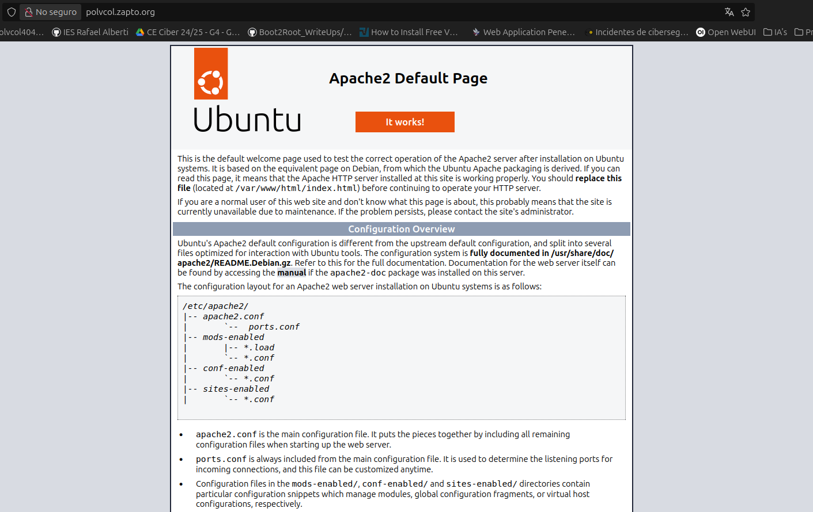

Añadimos también el dominio a nuestra cuenta de DigitalOcean.


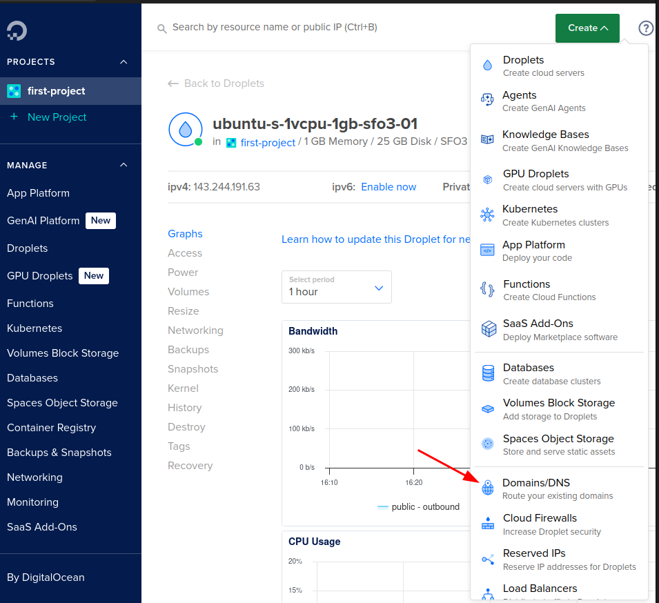

Escribimos nuestro dominio y le damos a "Add Domain".


Creamos el registro de tipo A apuntando a la IP pública del servidor web.

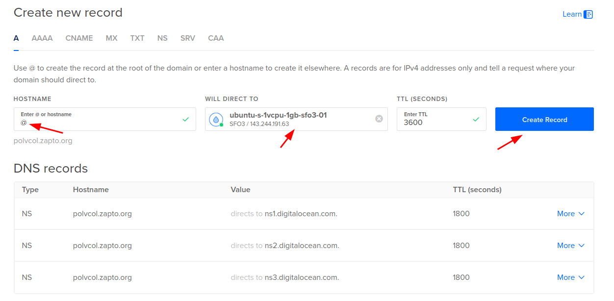

Y otro registro www apuntando a la IP pública también.

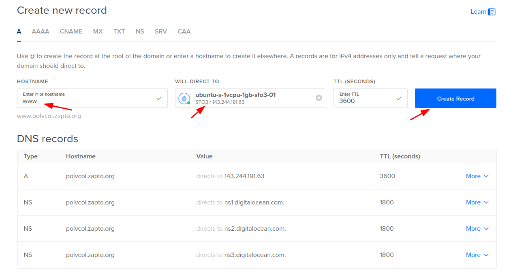

# Instalación de Certbot

Para obtener un certificado SSL con Let's Engryct, necesamos instalar CertBot en nuestro servidor.

```
sudo apt install certbot python3-certbot-apache
```
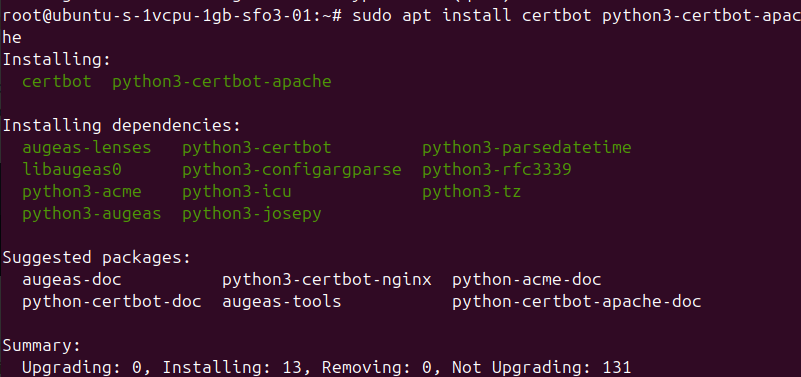

# Configuración del VirtualHost de Apache

Creamos un fichero de configuración de Apache de nuestro dominio.

```
sudo nano /etc/apache2/sites-available/polvcol.zapto.org.conf
```
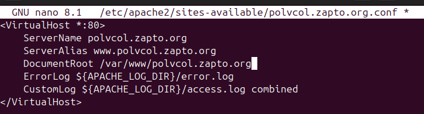

Comprobamos si hay algún error.

```
sudo apache2ctl configtest
```
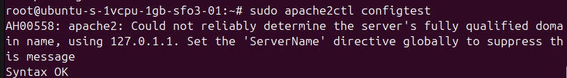

Si no hay ningún problema, recargamos apache.

```
sudo systemctl reload apache2
```

# Configuración de HTTPS

Usamos el plugin de certbot para configurar Apache con los ajustes necesarios.

```
sudo certbot --apache
```

Introducimos un correo.

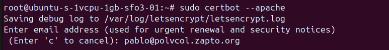

Aceptamos los términos y servicios escribiendo "Y".

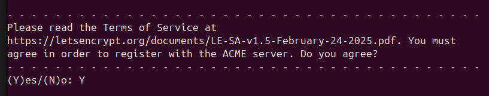

Decimos que no en este paso.

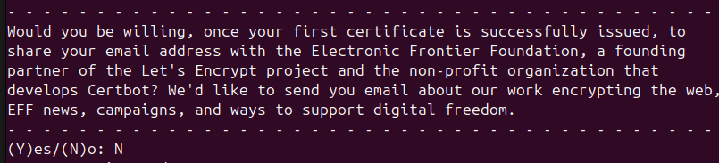

Introducimos el nombre de dominio que creamos para generar finalmente el certificado seguro con Let's Encrypt.


Accedemos a la web con HTTPS.

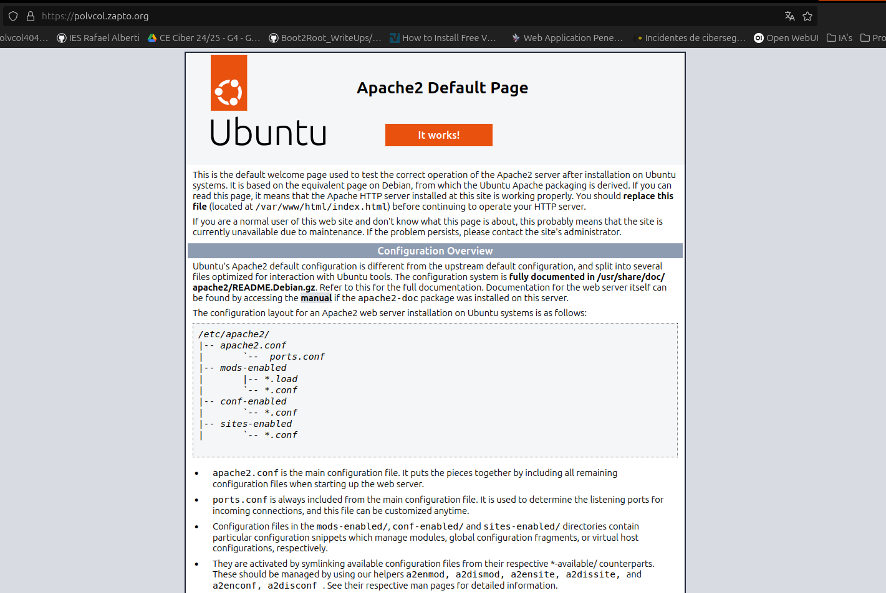

Esta es la información del certificado.

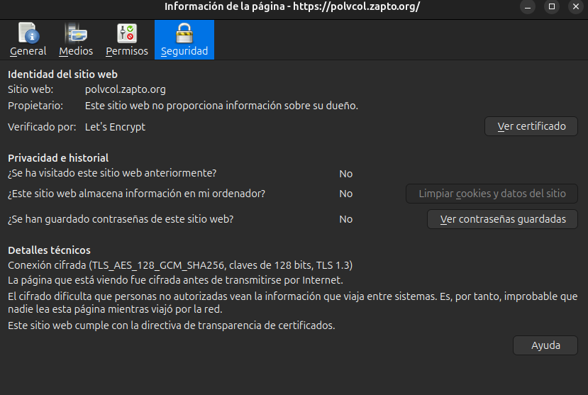

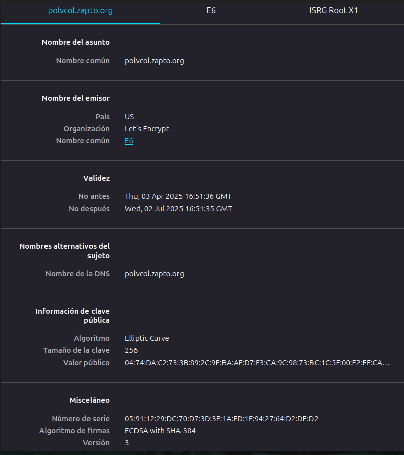

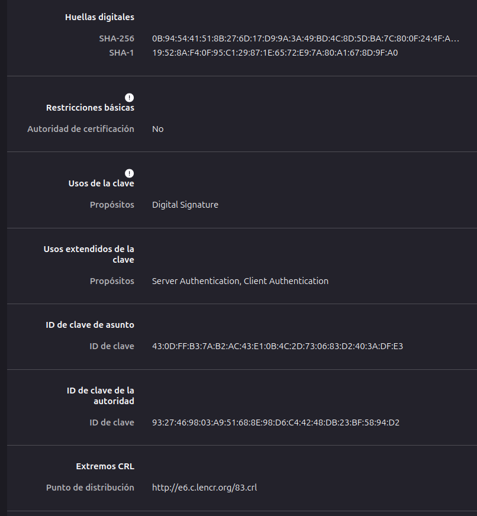

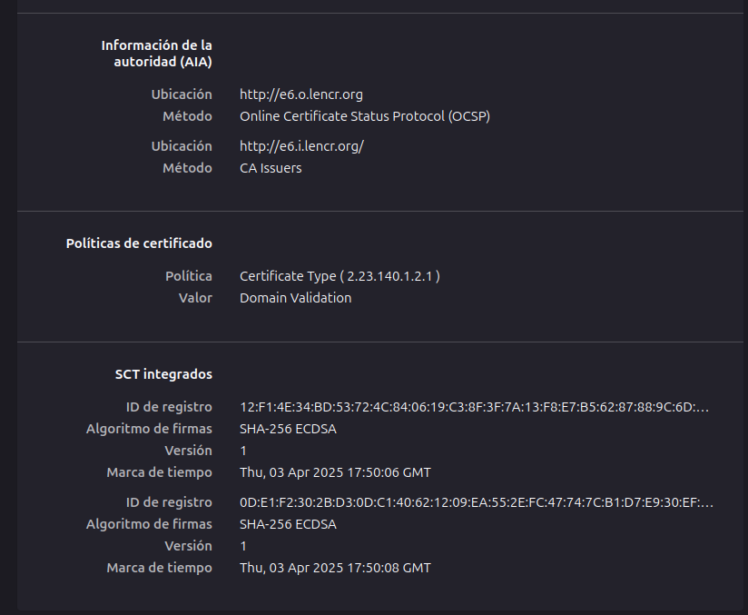

# Análisis y comparación con un sitio web verificado

Vamos a usar como otro ejemplo de sitio web verificado GitHub, el cual lo mostramos en las siguientes capturas:

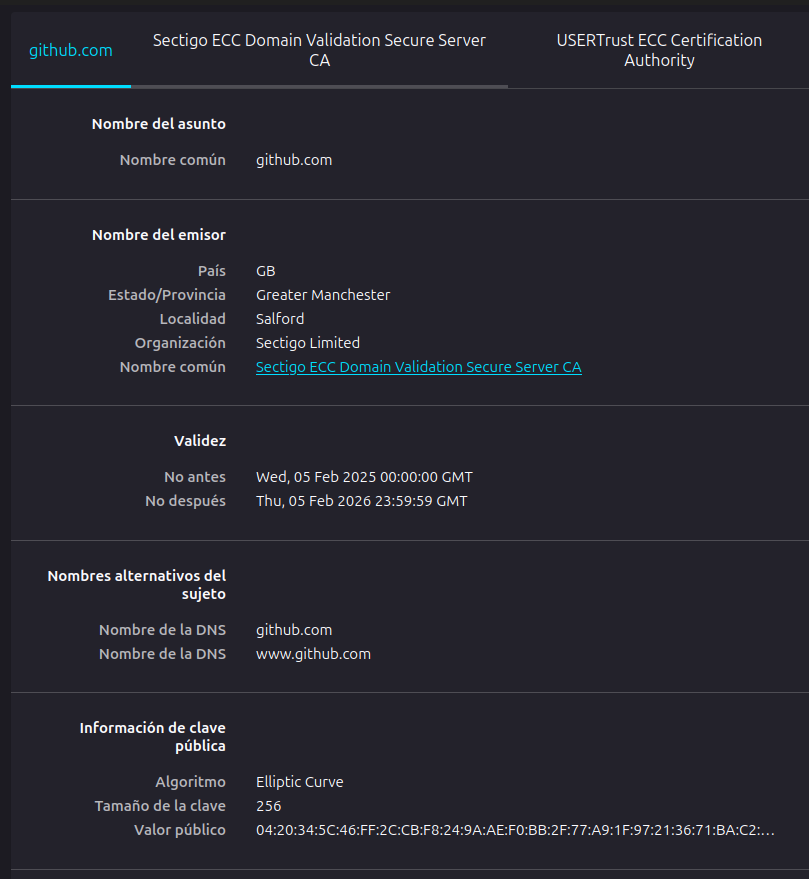


Lo primero que podemos destacar es que el emisor del certificado es obviamente distinto al de Let's Encrypt, la organización es Sectigo Limited, que es una autoridad certificadora comercial importante.

También otro punto a destacar es la validez, que el estándar de Let's Encrypt es de 90 días (renovación automática obligatoria) y en un sitio web verificado es de hasta 398 días.

Además, el OID de política, es de 1.3.6.1.4.1.44947.1.1.1, propio de Let's Encrypt y 2.23.140.1.2.1 es el identificador genérico de Sectigo DV.

Por otro lado, comparando los SCT Integrados, hay 3 entradas con el mismo algoritmo y marca de tiempo, lo cual hace que en Sectigo haya mayor redundancia al registrar el certificado en tres logs de CT diferentes, mientras que en Let's Encrypt solo está el mínimo requerido de dos logs.

Las IDs de registro tienen tres identificadores únicos en Sectigo que podría corresponder a logs operados por entidades como Google, y en Let's Encrypt los logs son propios de terceros confiables como Cloudflare.
# Conclusión

Este proyecto me ha permitido aprender a configurar un servidor web seguro con HTTPS en un entorno real utilizando Let's Encrypt en un servidor web alojado en DigitalOcean. También ha ayudado a comprender mejor las diferencias entre las CA gratuitas y comerciales, Let's Encrypt destaca por su accesibilidad y automatización, mientras que las CA comerciales añaden capas de validación y soporte para necesidades empresariales más complejas.
