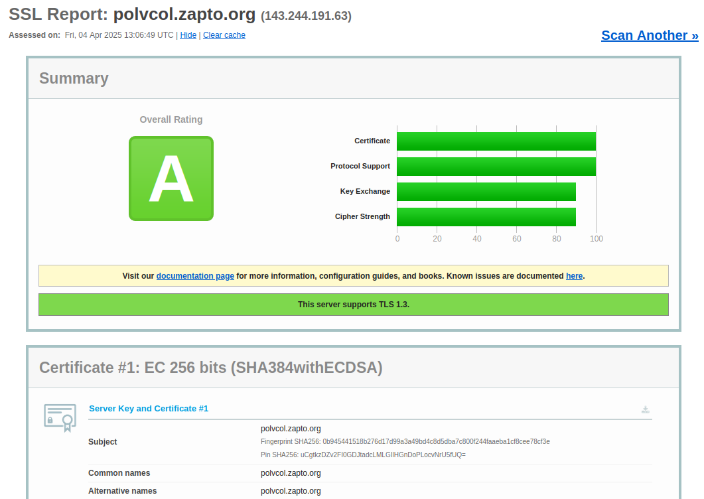
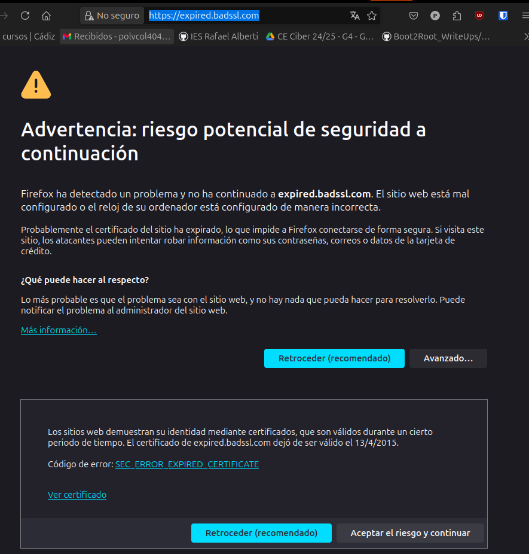
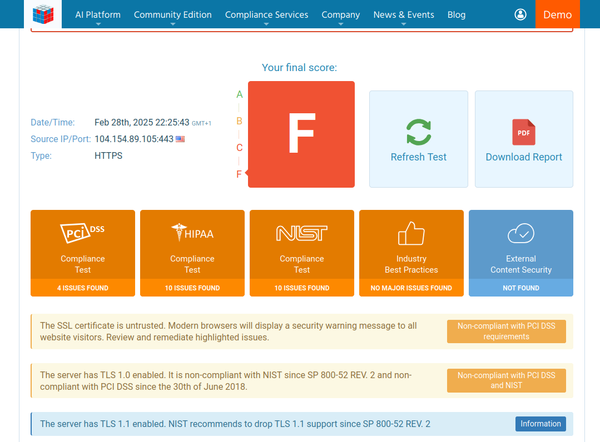
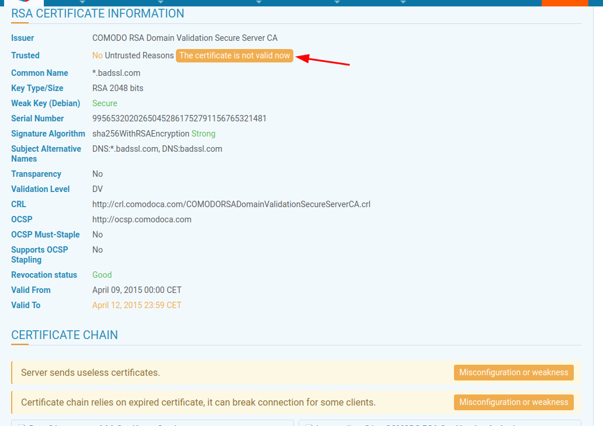
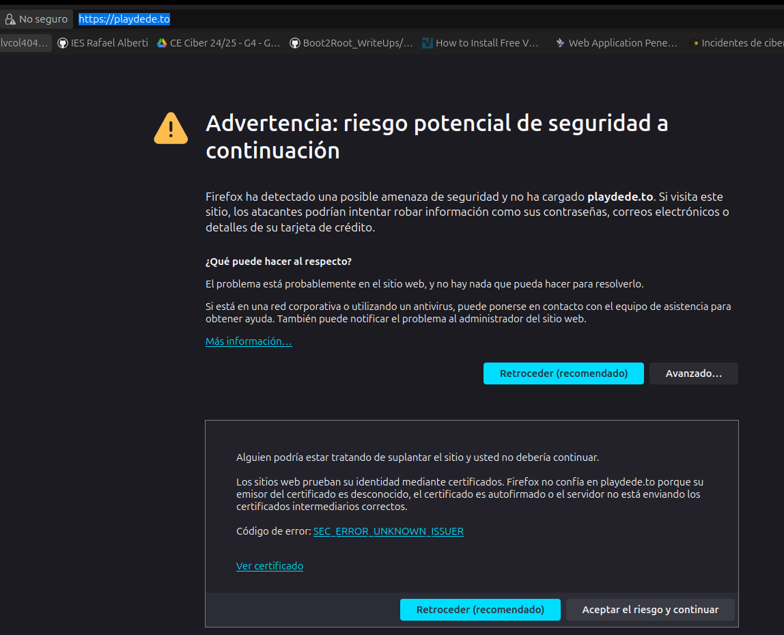
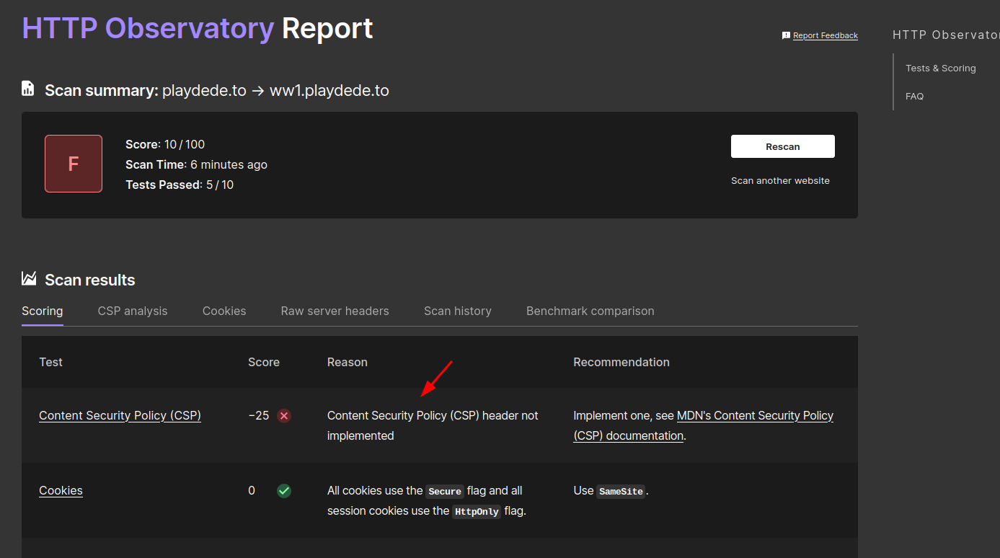
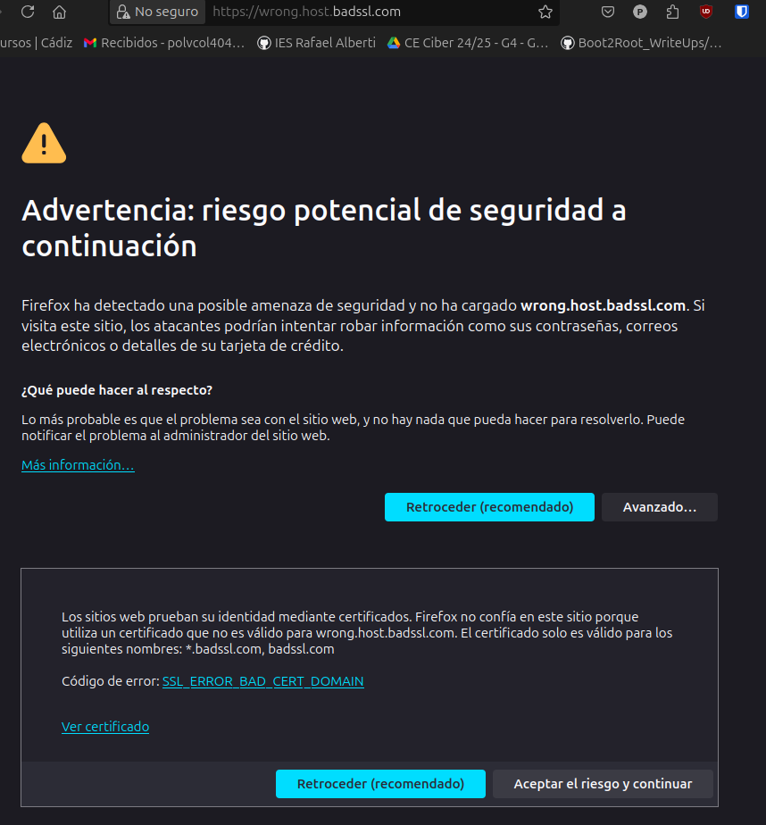
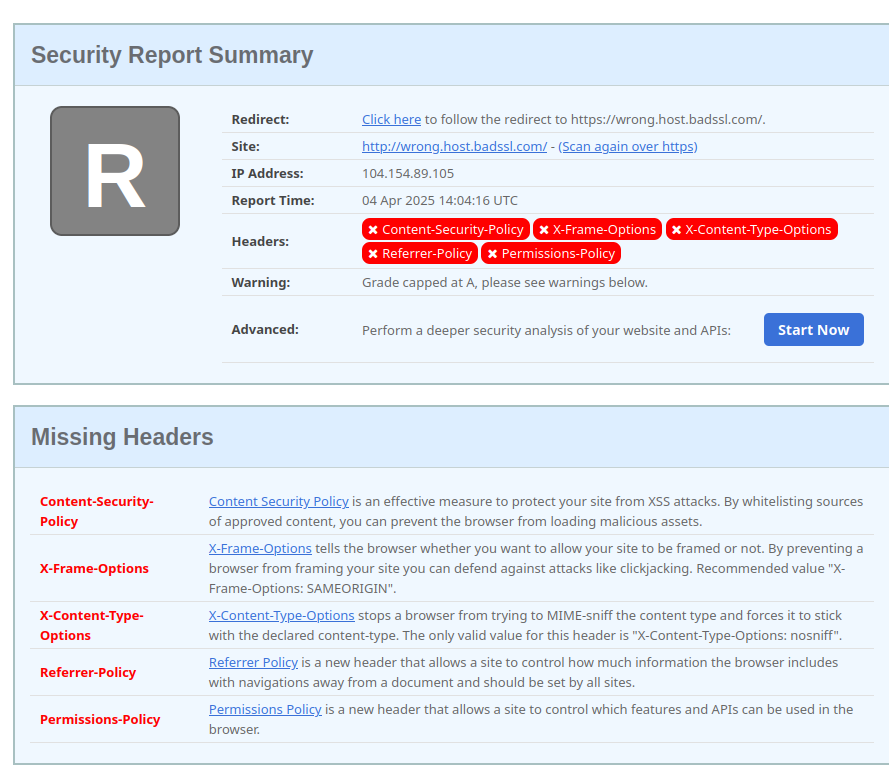

# Introducción

En esta parte, analizamos el certificado válido de Let's Encrypt de antes y explicamos los motivos por los cuales es identificado como válido. Además de que localizamos tres certificados erróneos de diferente tipo, analizándolos con otro servicio y explicando los motivos por qué no son válidos.
# Análisis del certificado con SSL Labs

Haciendo uso de la página web de [SSL Labs](https://www.ssllabs.com/ssltest/analyze.html?d=polvcol.zapto.org), obtenemos una calificación de A en nuestro dominio.

Es confiable debido a los siguientes motivos:

## Emisor confiable

El certificado fue emitido por Let's Encrypt Authority X3, una Autoridad Certificadora reconocida globalmente y confiable en navegadores y sistemas operativos. La cadena de certificados (certificado del sitio + intermediarios + raíz) está correctamente instalada.

## Validación del dominio (DV)

Let's Encrypt verificó que tenemos control sobre el dominio polvcol.zapto.org mediante un desafío automatizado. Esto hace que el certificado sólo se emitió al propietario legítimo del dominio.

## Configuración técnica correcta

El servidor está configurado para usar TLS 1.2 y TLS 1.3, evitando protocolos obsoletos e inseguros.
Se utilizan suites de cifrado modernas que ofrecen seguridad robusca contra ataques.

## Transparencia de certificados (CT)

El certificado incluye Signed Certificate Timestamps de logs públicos como Let's Encrypt "Oak2024".

## Validez vigente

El certificado está dentro del período de validez proporcionada por Let's Encrypt.

## Configuración de Apache correcta

El archivo`/etc/apache2/sites-available/polvcol.zapto.org.conf`está correctamente vinculado al dominio y redirige tráfico HTTP a HTTPS.

## Resultados del informe SSL Lab

El análisis que ha realizado SSL Lab confirma que no hay vulnerabilidades críticas, la configuración cumple con los estándares de seguridad actualizados y el certificado está correctamente alineado con el dominio y no hay errores de nombre (CN).

# Análisis de tres certificados erróneos

Vamos a analizar los siguientes tres sitios web con certificados errores con las herramientas [ImmuniWeb](https://www.immuniweb.com), [Mozilla Observatory](https://observatory.mozilla.org/) y [Security Headers Analyzer](https://securityheaders.com/).

## Certificado con validez expirada

El dominio de`https://expired.badssl.com/` ya no es seguro debido a que ha superado su fecha de expiración. Los certificados una vez vencidos, los navegadores y herramientas de seguridad los marcan como inseguros.

Además también está rota la cadena de confianza al no ser confiable por ningún navegador.

Tiene una calificación de F según ImmuniWeb.

Código de error: [SEC_ERROR_EXPIRED_CERTIFICATE](about:certerror?e=nssBadCert&u=https%3A//expired.badssl.com/&c=UTF-8&d=%20#certificateErrorDebugInformation)

## Certificado emitido por CA no reconocida

Debido a irregularidades en el dominio`playdede.to`, los navegadores han perdido la confianza en estos certificados y nos impiden entrar en la página web.

Obtiene la peor calificación en HTTP Observatory.

Código de error: [SEC_ERROR_UNKNOWN_ISSUER](about:certerror?e=nssBadCert&u=https%3A//playdede.to/&c=UTF-8&d=%20#certificateErrorDebugInformation)

## Certificado cuyo nombre no coincide

El sitio web de`wrong.host.badssl.com`tiene un certificado emitido por`*.badssl.com`pero el sitio accedido es distinto.

Código de error: [SSL_ERROR_BAD_CERT_DOMAIN](about:certerror?e=nssBadCert&u=https%3A//wrong.host.badssl.com/&c=UTF-8&d=%20#certificateErrorDebugInformation)

En SecurityHeaders obtenemos una calificación de R en el dominio.

# Conclusión

En conclusión, la seguridad y confianza de un sitio web dependen completamente de una configuración correcta de los certificados. Un ejemplo de configuración correcta la tenemos con Let's Encrypt, mientras que por el contrario existen certificados erróneos que ponen en riesgo la seguridad de las comunicaciones y generan errores en los navegadores impidiendo el acceso al contenido.

Es muy importante mantener y supervisar de manera continua la infraestructura SSL para asegurar la integridad y la privacidad de las transmisiones de datos.
